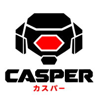

<p align="center">
  <picture>
    <source media="(prefers-color-scheme: dark)" srcset="misc/casper-dark.svg">
    <source media="(prefers-color-scheme: light)" srcset="misc/casper.svg">
    
  </picture>
</p>

<p align="center"><em>The tools a coding agent runs, and the screen they draw on.</em></p>

<p align="center">
  <a href="https://claude.ai/code/artifact/cf3ff7f0-1c1d-472a-b01e-d08a854178b1"><strong>How the four fit together</strong></a> —
  a turn end to end, writing a tool, memory both directions, what may run
</p>

A separate binary a harness runs to do things: read a file, search a tree, run a command, and —
when a tool needs more than a line of output — hold rows on the harness's own screen and draw
into them. It knows nothing about models, turns or transcripts. Those belong to whatever harness
is using it.

## What it offers

```sh
casper tools                 # every tool it offers, as declarations a harness can register
casper run <tool>            # run one; the call arrives as JSON on stdin
casper surface <tool>        # hold rows on the harness's screen and draw into them
```

| | |
|---|---|
| `cat` `ls` `find` `grep` `patch` | read the tree |
| `shell` `pwd` | run a command, and remember where it ran |
| `screen` | an interactive program — a pager, an editor, `htop`, `git add -p` — in rows on the screen |
| `hexe` `oslo` `session` | ask the multiplexer, the shell, or the harness about themselves |
| `dino` `birdy` | two games, because a surface that can draw a game can draw anything |

Every one of them is declared in `config/tools.lua`, in Lua, and nothing about them is compiled
in. A tool of your own goes in the same file.

## Surfaces

Most tools print and exit. Some need the screen: an editor, a pager, a picker, a permission
prompt, a game. A **surface** is a tool that asks the harness for a number of rows and then owns
them — it is handed keys and clicks, it draws each frame, and it ends when it says so or when
the person presses escape twice.

The harness decides how many rows; casper decides what goes in them. That split is the whole
protocol: a harness that knows nothing about pagers can host one, and a tool that knows nothing
about terminals can be drawn by any harness that can lend it rows.

A surface may also ask the harness questions it cannot answer itself:

```lua
local who   = casper.knows("session")                       -- which session, and where
local found = casper.knows("memories", { query = "deploy" }) -- what it remembers
```

`casper.knows` exists only inside a surface, and structurally so: a `run` is one exec whose
stdout is its reply, and a question written there would reach the harness as the tool's own
result.

## How this family talks

Three transports, two shapes, one encoding — written out because it was written out nowhere, and
five wires had grown five ways to say the same thing.

| Transport | When | Framing |
|---|---|---|
| **argv** | a question with an answer and nothing to hold open | one JSON object on stdout |
| **pipe** | a parent and the child it started | newline-delimited JSON, both directions |
| **socket** | anything may knock | four bytes of big-endian length, then JSON |

JSON is on all three. It is the *encoding*, not a transport.

A **call** is answered; an **event** is not:

```
->  {"call":"status","args":[]}
<-  {"ok":true,"family":1,"n":1,"result":[{"busy":false}]}

    {"event":"listening","at":"…"}
```

`result` is a **list** and `n` says how long it is: a sibling that unpacked a bare value would
read an answer as nothing at all. `family` says which revision the reply is written in — a reader
refuses a number it does not know and tolerates one it predates. A refused call is a *reply*, not
a dropped connection.

**The tag key is `event`, everywhere, in both directions**, and `gate-wire` refuses any other.
The failure it prevents is silent: two of these wires exist as byte-identical copies in two
repositories, so when two spellings drift nothing fails and no test goes red — the surface simply
stops being answered.

## Commands

The build is `.make.lua`, read by [oslo](https://github.com/termworks/oslo). At an oslo prompt in
this directory `make` is enough; anywhere else it is `oslo make`.

```sh
make                      # the recipes, with what each of them says it does
make build
make run --args='--help'
make test
make verify
make release --type patch
```

The directory environment is `.env.lua`, loaded when you `cd` here and unloaded when you leave. It
brings up the flake's dev shell and defines `_b`, `_r`, `_t`, `_v` and `_i` for the commands above.

## Requirements

`.make.lua` and `.env.lua` are read by [oslo](https://github.com/termworks/oslo), which provides
both the `make` task runner and the directory environment. Without it, `make` is whatever is on
your `$PATH` and `.env.lua` is never loaded.

```sh
# at an oslo prompt in this directory
make build

# anywhere else
oslo make build
```
